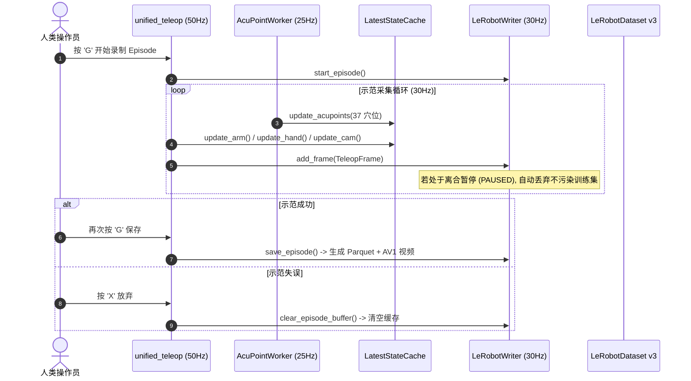

# TuinaDex 22-DOF LeRobot 数据采集与录制系统操作手册

本目录 (`Co_Teleop/recording/`) 包含 TuinaDex 中医推拿机器人接入 **LeRobot 0.4.4** 的数据采集、强类型数据契约与持久化写入组件。

---

## 目录结构

```text
Co_Teleop/recording/
├── README.md               # 本操作手册
├── teleop_frame.py         # 强类型全模态数据契约 (TeleopFrame, Arm/Hand/Camera/AcupointObs)
├── lerobot_writer.py       # LeRobotDatasetWriter (Parquet 表 + SVT-AV1 视频压缩 + 离合清洗)
└── raw_recorder.py         # RawRecorder (JSONL 全遥测底层诊断记录器)
```

---

## 核心工作流与操作流程



---

## 快捷键操作一览表

| 按键 | 功能说明 | 触发状态 / 反馈 |
| :--- | :--- | :--- |
| **`G`** | **一键开始 / 保存录制** | 首次按下：开启录制（HUD 出现红色 `● REC Ep #N`）；再次按下：保存 Episode。 |
| **`X`** | **一键放弃当前录制** | 丢弃未保存的当前 Episode 缓存，不写入数据集，帧数清零。 |
| **`SPACE` (空格)** | **离合控制 (Clutch)** | **按住**：机械臂与灵巧手实时跟随手势；**松开**：悬停暂停，**自动过滤 PAUSED 帧**。 |
| **`L`** | **灵巧手姿态锁定** | 锁定 16 舵机当前手势，机械臂可继续空间移动（用于保持特定按压手法）。 |
| **`1` ~ `4`** | **推拿手法切换** | `1`: 大椎穴按揉 (`kneading`)<br>`2`: 肩井穴滚法 (`rolling`)<br>`3`: 天宗穴点穴 (`point_press`)<br>`4`: 督脉抚摩 (`stroking`) |
| **`R`** | **准备姿态 (READY)** | 机械臂平稳运动至推拿准备位。 |
| **`Q` / `ESC`** | **安全退出** | 机械臂安全下电并释放所有相机与总线句柄。 |

---

## 数据集特征字段定义 (LeRobot 0.4.4 Schema)

| 键名 | 形状 / 类型 | 说明 |
| :--- | :--- | :--- |
| `observation.state` | `(22,) float32` | 22 轴真实物理关节角度（6 臂 + 16 手，单位：rad） |
| `observation.images.overhead_cam` | `(480, 640, 3) video` | 推拿工作区工业相机 RGB 视频流（AV1/MP4 编码） |
| `observation.environment.acupoints` | `(37, 3) float32` | 37 个穴位 2D 坐标与置信度 `[x_px, y_px, score]` |
| `action` | `(22,) float32` | 22 轴执行目标动作（6 臂 + 16 手，单位：rad） |
| `task` | `string` | 当前推拿任务语义名称（如 `"按揉大椎穴"`） |

---

## 常用运维与验证命令

```bash
# 1. 启动全模态采集 (含工作区工业相机与 37 穴位检测)
conda activate leap_hand
python Co_Teleop/pipeline/unified_teleop.py --real --cam-mode industrial

# 2. 数据集完整性与限位审计
conda activate smolvla
python tools/dataset_validate.py --dataset-dir ./datasets/lerobot_tuina

# 3. 交互式可视化回放与样本打标 (V/R/D)
conda activate smolvla
python tools/dataset_visualizer.py --dataset-dir ./datasets/lerobot_tuina

# 4. 0.3x 真机慢速重放与跟踪误差 RMSE 评估
conda activate smolvla
python tools/dataset_replay.py --dataset-dir ./datasets/lerobot_tuina --episode 0 --mode real --speed-ratio 0.3

# 5. 启动本地 RTX 3090 模型训练
conda activate smolvla
python apps/train_tuina_policy.py --dataset-dir ./datasets/lerobot_tuina --policy act --epochs 100
```
