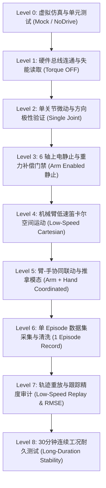

# TuinaDex 22-DOF 真实硬件联调与安全验收规范

本文档为 TuinaDex 22-DOF 机械臂与 LEAP 灵巧手接入 LeRobot 产数/控制闭环的**唯一标准真机验收操作手册**。任何上电与动作下发操作必须严格遵循本文档规定的分级门禁。

---

## 1. 核心安全哲学与铁律

1. **真实模式严禁静默回退（No Silent Fallback）**：`mock_mode=False` 时任何总线通信异常立即终止并置为 `HARDWARE_FAULT`；
2. **分级阶梯爬升（8-Level Safety Ladder）**：严禁跳级测试；只有上一级所有测试项获得 `[PASS]`，方可进入下一级；
3. **上电前姿态前置审查（Pre-Arm Pose Verification）**：必须确认机械臂当前物理角度处于安全起始包络内，且确认 J2/J3 重力负载；
4. **人类最高抢占权（Human Highest Priority Preemption）**：空格键 `[SPACE]` 随时断开离合器或进入安全悬停。

---

## 2. 标准 8 级安全验证阶梯 (Safety Ladder)



---

## 3. 逐级详细验收步骤与操作指南

### Level 0：虚拟仿真与单元测试 (Mock / Dry-Run)
- **目标**：验证全部代码逻辑、契约定义与算法无语法/数值异常。
- **命令**：
  ```bash
  conda run -n leap_hand pytest Co_Teleop/tests/ tests/
  conda run -n smolvla pytest tests/
  ```
- **验收标准**：70/70 单元测试全部通过。

---

### Level 1：硬件总线连通与失能读取 (Torque OFF)
- **目标**：验证 CAN 总线与串口物理连通，读取当前真实关节角度，绝不上电使能。
- **检查项**：
  1. 机械臂 SocketCAN 500kbps 连通，`candump can0` 能抓取电机广播包；
  2. 灵巧手 USB-TTL 串口（4Mbps）连通，读取 16 舵机当前角度；
  3. `TuinaRobot.connect()` 成功进入 `SAFE_IDLE` 状态，`is_connected=True`, `is_armed=False`。

---

### Level 2：单关节微动与方向极性验证
- **目标**：验证各电机旋转方向、减速比与符号映射表（JOINT_DIR）与物理实际一致。
- **检查项**：
  1. 机械臂 J1~J6 单关节微动 1°，方向与右手定则定义一致；
  2. 灵巧手食指、中指、无名指、拇指各关节屈伸方向正确。

---

### Level 3：6 轴上电静止与重力补偿门禁
- **目标**：机械臂进入使能保持态，无低频抖动或异常电流。
- **检查项**：
  1. 执行 `arm(gravity_confirmed=True)`；
  2. 机械臂 6 轴刹车平稳松开，机械臂在重力作用下不下坠，静止维持当前姿态；
  3. 电机空载电流处于标称安全区间（< 800mA）。

---

### Level 4：机械臂低速笛卡尔空间运动
- **目标**：操作员手势驱动机械臂平稳运动，看门狗有效。
- **检查项**：
  1. 按 `R` 键运动至准备姿态（READY）；
  2. 按 `SPACE` 启动跟随，手腕移动，机械臂线速度跟随平滑；
  3. 遮挡操作员手部，看门狗在 150ms 内触发减速并在 300ms 内平稳悬停。

---

### Level 5：臂-手协同联动与推拿模态
- **目标**：同时解耦控制机械臂宏观位姿与灵巧手推拿手势。
- **检查项**：
  1. 按 `1~4` 键切换推拿手法（按揉、滚法、点穴、抚摩）；
  2. 五指屈伸驱动灵巧手 16 舵机柔顺抓握与按压；
  3. 按 `L` 键锁定灵巧手姿态，机械臂继续运动。

---

### Level 6：单 Episode 数据集采集与清洗
- **目标**：完整录制一段 60 秒的推拿示范轨迹，生成标准 LeRobotDataset v3。
- **检查项**：
  1. 按 `G` 键开始录制，HUD 显示红色 `REC Ep #1` 标志；
  2. 按 `SPACE` 离合暂停，确认数据集写入器自动过滤 PAUSED 帧；
  3. 按 `G` 键保存，运行 `python tools/dataset_validate.py` 验证时序与限位合规。

---

### Level 7：轨迹重放与跟踪精度审计 (Replay & RMSE)
- **目标**：使用录制的 Dataset Action 驱动真实机械臂以 0.3x 慢速复现推拿动作。
- **命令**：
  ```bash
  python tools/dataset_replay.py --dataset-dir ./datasets/lerobot_tuina --episode 0 --mode real --speed-ratio 0.3
  ```
- **验收标准**：
  - 机械臂 6 轴跟随 RMSE < 0.05 rad (< 3.0°)；
  - 灵巧手 16 轴跟随 RMSE < 0.08 rad (< 4.5°)；
  - 重放过程中按空格键可随时中止。

---

### Level 8：30分钟连续工况耐久测试
- **目标**：多 Episode 连续采集与运行，验证系统无内存泄漏与通信丢包。
- **检查项**：
  1. 连续录制 10 个 Episode；
  2. SocketCAN 无 Error Frame；
  3. RealSense D455 与工业相机无掉帧或时钟漂移。

---

## 4. 真机联调验收打卡表 (Checklist)

| 阶段 | 测试项 | 责任人 | 状态 | 备注 |
| :--- | :--- | :--- | :--- | :--- |
| **L0** | 双环境 70 单元测试全部通过 | Agent | `[PASS]` | 66 leap_hand + 4 smolvla |
| **L1** | SocketCAN can0 500kbps 通信 | 现场操作员 | `[PENDING]` | 待连接真实 USB-CAN 盒 |
| **L1** | LEAP Hand /dev/ttyUSB0 4Mbps 通信 | 现场操作员 | `[PENDING]` | 待连接真实串口 |
| **L1** | SAFE_IDLE 状态门禁与上电回滚 | Agent / 现场 | `[PASS]` | 代码已加固 |
| **L2** | J1~J6 单关节方向与限位 | 现场操作员 | `[PENDING]` | 上电前微动核对 |
| **L3** | J2/J3 重力关节确认使能 | 现场操作员 | `[PENDING]` | 保持 READY 姿态 |
| **L4** | D455 手势遥操平滑跟随 | 现场操作员 | `[PENDING]` | 1/2/3 档位灵敏度正常 |
| **L4** | 视觉看门狗丢帧悬停保护 | 现场操作员 | `[PENDING]` | 遮挡人手测试 |
| **L5** | 臂-手解耦协同与模态切换 | 现场操作员 | `[PENDING]` | F1~F4 与 L 键锁定 |
| **L6** | 单 Episode 产数与 PAUSED 帧清洗 | 现场操作员 | `[PENDING]` | 生成 Parquet 与 MP4 |
| **L6** | 数据集完整性审计工具校验 | 现场操作员 | `[PENDING]` | `dataset_validate.py` |
| **L7** | 0.3x 真机慢速重放与 RMSE 评估 | 现场操作员 | `[PENDING]` | `dataset_replay.py` |
| **L8** | 10 Episode 连续采集与 ACT 训练 | 现场操作员 | `[PENDING]` | `train_tuina_policy.py` |
