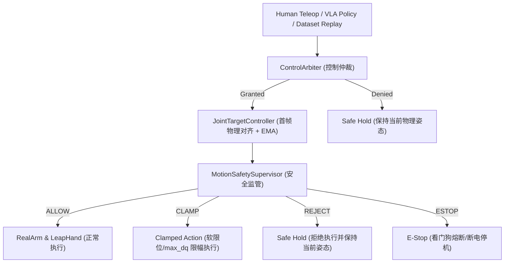

# TuinaDex 22-DOF 中医推拿机械臂-灵巧手 LeRobot 接入与数据对接技术规范 (tuinadex_to_lerobot)

> **文档版本**: v1.2.0 (全模态闭环与真机验收增强版)  
> **适用对象**: 上游视觉遥操开发团队 (`Co_Teleop`)、下游 LeRobot / VLA 具身智能算法团队 (`Arm-robot_VLA`)  
> **核心硬件体系**: 6-DOF 闭环步进机械臂 (SocketCAN, 500kbps) + 16-DOF LEAP Hand 灵巧手 (Dynamixel, 4Mbps) + 推拿工作区工业相机 (640x480 RGB @ 30Hz) + 操作员手势追踪相机 (RealSense D455) + 华为昇腾 NPU (AcuPointDet 37 穴位检测)

---

## 目录
1. [系统总体架构与数据流 (Three-Loop 异步多速率架构)](#1-系统总体架构与数据流-three-loop-异步多速率架构)
2. [标准数据契约与特征空间定义 (Schema & Spec)](#2-标准数据契约与特征空间定义-schema--spec)
3. [相机角色划分与视角布局原则](#3-相机角色划分与视角布局原则)
4. [TuinaRobot LeRobot 0.4.4 BYOH 官方插件实现](#4-tuinarobot-lerobot-044-byoh-官方插件实现)
5. [运动控制与三级安全监管栈 (Arbiter & Safety Stack)](#5-运动控制与三级安全监管栈-arbiter--safety-stack)
6. [数据采集与全自动离合清洗机制](#6-数据采集与全自动离合清洗机制)
7. [数据集质检、可视化与真机重放评测工具链](#7-数据集质检可视化与真机重放评测工具链)
8. [本地 RTX 3090 SmolVLA / ACT 模型训练指南](#8-本地-rtx-3090-smolvla--act-模型训练指南)
9. [接口对接常见问题 (FAQ) 与排错指南](#9-接口对接常见问题-faq-与排错指南)

---

## 1. 系统总体架构与数据流 (Three-Loop 异步多速率架构)

系统采用严密的**三环异步解耦架构 (Three-Loop Topology)**，彻底杜绝高频控制、重型感知与数据集写入相互阻塞：

```text
┌──────────────────────────────────────────────────────────────────────────────────┐
│                         1. 控制环路 Control Loop (50Hz / 20ms)                   │
│                                                                                  │
│   【操作员手部追踪】                       【策略/重放动作源】                     │
│   RealSense D455 3D关键点              SmolVLA / ACT / DatasetReplay             │
│        │                                        │                                │
│        ▼                                        ▼                                │
│   CartesianController                   JointTargetController                    │
│   (笛卡尔速度与姿态增量)                  (首帧物理位姿对齐 + EMA平滑)             │
│        │                                        │                                │
│        └───────────────────┬────────────────────┘                                │
│                            ▼                                                     │
│                     ControlArbiter (控制仲裁器: 人类无条件最高抢占权)            │
│                            │ (22D 目标弧度)                                      │
│                            ▼                                                     │
│                  MotionSafetySupervisor (三级安全裁决: CLAMP / REJECT / ESTOP)   │
│                            │ (实测有界 dt 裁剪)                                  │
│                            ▼                                                     │
│                 【实体机械臂 & 灵巧手硬件】                                      │
│                 • 机械臂 SocketCAN 500kbps 闭环 (0xFD 协议)                      │
│                 • LEAP Hand 串口 4Mbps (16 舵机绝对弧度)                         │
└────────────────────────────┬─────────────────────────────────────────────────────┘
                             │ (实时物理状态写入)
                             ▼
┌──────────────────────────────────────────────────────────────────────────────────┐
│                        2. 感知环路 Perception Loop (20~30Hz)                     │
│                                                                                  │
│   【工作区工业相机】                                                             │
│   640x480 RGB 视频流 (30Hz)                                                      │
│        │                                                                         │
│        ├─────────────────────────────────────────┐                               │
│        ▼                                         ▼                               │
│   CameraManager (最新帧缓存)               AcuPointWorker (异步守护线程)          │
│        │                                   • RTMDet_Tiny (背部检测)              │
│        │                                   • RTMPose_s (37 穴位估计)             │
│        │                                   • PyACL / Ascend NPU 硬件加速         │
│        │                                         │ (37x3 [x,y,conf])             │
│        ▼                                         ▼                               │
│   ┌────────────────────────────────────────────────────────┐                     │
│   │                 LatestStateCache                       │                     │
│   │   • arm_obs (100Hz Poller)    • hand_obs (60Hz Poller) │                     │
│   │   • overhead_cam (30Hz)       • acupoints (20~30Hz)    │                     │
│   │   • 硬件/感知时钟鲜度监控 (Staleness / Degraded Detection)│                  │
│   └───────────────────────────┬────────────────────────────┘                     │
└───────────────────────────────┼──────────────────────────────────────────────────┘
                                │ (30Hz 定时原子快照读取)
                                ▼
┌──────────────────────────────────────────────────────────────────────────────────┐
│                        3. 数据集环路 Dataset Loop (30Hz)                         │
│                                                                                  │
│                     ObservationAggregator (观测聚合器)                           │
│                                │                                                 │
│                                ▼                                                 │
│                           TeleopFrame                                            │
│                    /                       \                                     │
│                   ▼                         ▼                                    │
│           RawRecorder (JSONL)       LeRobotDatasetWriter                         │
│           (底层全遥测诊断日志)      • 自动清洗 PAUSED 离合帧                     │
│                                     • 写入 Parquet 元数据表                      │
│                                     • 写入 Overhead SVT-AV1/MP4 视频流           │
│                                     • 写入 37 穴位结构化特征                     │
│                                             │                                    │
│                                             ▼                                    │
│                                      LeRobotDataset v3                           │
└──────────────────────────────────────────────────────────────────────────────────┘
```

---

## 2. 标准数据契约与特征空间定义 (Schema & Spec)

所有数据在进入 LeRobot 数据集或由策略模型输出时，**严格采用国际标准单位制 (SI Units: 弧度 Radian)**。

### 2.1 观测空间 (Observation Space)

| 特征键名 (`features` key) | 维度 / 类型 | 范围 / 说明 |
| :--- | :--- | :--- |
| `observation.state` | `(22,) float32` | 22 自由度当前关节真实状态（前 6 维机械臂，后 16 维灵巧手，单位：$\text{rad}$） |
| `observation.images.overhead_cam` | `(480, 640, 3) video` | 推拿工作区工业相机 RGB 视频流（SVT-AV1 / H.264 硬件编码） |
| `observation.environment.acupoints` | `(37, 3) float32` | 人体背部 37 个穴位 2D 坐标与置信度 `[x_px, y_px, score]` |

### 2.2 动作空间 (Action Space)

| 特征键名 (`features` key) | 维度 / 类型 | 范围 / 说明 |
| :--- | :--- | :--- |
| `action` | `(22,) float32` | 22 自由度下一控制周期的**目标关节绝对弧度 (rad)**（前 6 臂 + 后 16 手） |

### 2.3 22 轴物理关节映射与限位定义

```text
Index 00 ~ 05: 【6-DOF 机械臂关节】
  - Index 00: J1 基座水平回转 (Base Yaw)        [-0.017, 6.283] rad (0° ~ 360°)
  - Index 01: J2 大臂主俯仰 (Shoulder Pitch)     [-0.017, 2.618] rad (0° ~ 150°)
  - Index 02: J3 小臂肘部俯仰 (Elbow Pitch)      [-0.017, 2.094] rad (0° ~ 120°)
  - Index 03: J4 小臂腕部滚转 1 (Wrist Roll 1)   [-1.571, 1.571] rad (-90° ~ +90°)
  - Index 04: J5 腕部俯仰 (Wrist Pitch)         [-0.017, 3.142] rad (0° ~ 180°)
  - Index 05: J6 腕部滚转 2 / 工具法兰 (Wrist Roll 2) [-0.017, 6.283] rad (0° ~ 360°)

Index 06 ~ 21: 【16-DOF LEAP Hand 灵巧手关节】
  - Index 06 ~ 09: 食指 Index (Yaw, MCP, PIP, DIP)   [-0.20, 3.14] rad
  - Index 10 ~ 13: 中指 Middle (Yaw, MCP, PIP, DIP)  [-0.20, 3.14] rad
  - Index 14 ~ 17: 无名指 Ring (Yaw, MCP, PIP, DIP)  [-0.20, 3.14] rad
  - Index 18 ~ 21: 拇指 Thumb (Rot, CMC, MCP, IP)    [-0.20, 3.14] rad
```

---

## 3. 相机角色划分与视角布局原则

系统严格解耦**操作员控制相机**与**推拿工作区感知相机**：

```text
 ┌──────────────────────────────────────────────────────────────────────────────────┐
 │                               【相机源职责与数据流向解耦】                         │
 ├─────────────────────────────────────┬────────────────────────────────────────────┤
 │ 相机设备与角色                      │ 功能定位与是否进入 VLA 训练集              │
 ├─────────────────────────────────────┼────────────────────────────────────────────┤
 │ 1. RealSense D455 (操作员遥操追踪)  │ ❌ 绝对不进入 VLA 训练数据。               │
 │    - 位于操作员前方                 │ 仅作为“主端手势遥控器”，通过 MediaPipe 捕   │
 │                                     │ 获人手 21 关节点，解算并生成 22-DOF 动作。 │
 ├─────────────────────────────────────┼────────────────────────────────────────────┤
 │ 2. 推拿工作区工业相机 (场景与环境视觉)│ ✅ 核心 VLA 训练视觉输入。                 │
 │    - 位于推拿床上方俯视工作区       │ 捕捉患者人体背部、37 穴位区域、机械臂与灵巧 │
 │                                     │ 手在人体上的真实按压、揉捏与交互过程。     │
 └─────────────────────────────────────┴────────────────────────────────────────────┘
```

* **推荐视角布局**：
  * **视角 A（主环境顶置，`overhead_cam`）**：推拿床上方 1.2~1.5m 俯视 70°~90°，捕获全背轮廓并输入 `AcuPointDet`；
  * **视角 B（腕部微距，`wrist_cam`，可选）**：安装在机械臂 J6 法兰侧边，极近距离观察指尖屈伸、揉按相位与皮肤凹陷深度。

---

## 4. TuinaRobot LeRobot 0.4.4 BYOH 官方插件实现

插件代码位于 [`packages/lerobot_robot_tuinadex/`](file:///home/bright/win_office/ubantu_files/project/TuinaDex/packages/lerobot_robot_tuinadex)，符合 LeRobot 官方 `Robot` 基类与 Entry-Point 规范。

### 核心安全与生命周期规范：
1. **真实硬件禁止静默降级（No Silent Fallback）**：
   - `mock_mode=False` 时硬件连接失败立即抛出 `[HARDWARE_FAULT]` 并将状态置为断开，严禁静默回退到 `NoDrive` 录制假数据；
2. **事务性回滚（Rollback on Failure）**：
   - 若 Arm 成功但 Hand 失败，自动调用 `arm_adapter.disconnect()` 回滚释放全部已打开句柄；
3. **纯缓存读取（Cache-Only Observation）**：
   - `get_observation()` 纯调用 `LatestStateCache.snapshot()` 读取原子快照，零现场总线 IO 阻塞；
4. **实测有界 `dt` 动作下发**：
   - `send_action()` 采用 `time.monotonic()` 测算瞬时真实 `dt`，并硬夹紧在 `[0.005s, 0.100s]` 之间。

---

## 5. 运动控制与三级安全监管栈 (Arbiter & Safety Stack)



* **三级安全裁决语义**：
  * `ALLOW`：动作完全合法，原样放行；
  * `CLAMP`：轻微越界，经软限位/max_dq 夹紧后安全执行；
  * `REJECT`：严重超限（> 60° 跳变）或无有效基准，拒绝执行并保持当前姿态；
  * `ESTOP`：看门狗超时/硬件故障/急停信号，立即停机；
* **首帧状态基准对齐**：平滑滤波器必须以 `current_state_22d` 真实物理角度初始化；若当前状态为空直接 `REJECT`，杜绝未对齐引起的首帧大幅冲击。

---

## 6. 数据采集与全自动离合清洗机制

在主控管线 [`unified_teleop.py`](file:///home/bright/win_office/ubantu_files/project/TuinaDex/Co_Teleop/pipeline/unified_teleop.py) 中：
1. **一键启停与保存**：
   * 按 **`G`** 键：开启录制，HUD 显示红色 `● REC Ep #N`；
   * 再次按 **`G`** 键：结束并保存当前 Episode，生成 Parquet 表与工作区 MP4 视频；
   * 按 **`X`** 键：一键废弃并清空当前 Episode 缓存（操作失误时不污染数据集）；
2. **空格离合自动清洗（Clutch Pause Filtering）**：
   * 按住 `SPACE`：离合闭合，机械臂与灵巧手跟随手势；
   * 松开 `SPACE`：离合断开，进入 `PAUSED` 悬停状态；
   * **`LeRobotDatasetWriter` 会自动丢弃所有 `PAUSED` 帧**，确保导出的数据集均为高质量连续示范轨迹；
3. **手法与穴位动态切换**：
   * 按 `1`~`4` 键一键切换手法元数据（按揉大椎穴、滚法肩井穴、点穴天宗穴、抚摩督脉）。

---

## 7. 数据集质检、可视化与真机重放评测工具链

```bash
# 1. 运行自动化合规与物理限位审计
conda activate smolvla
python tools/dataset_validate.py --dataset-dir ./datasets/lerobot_tuina

# 2. 启动交互式可视化回放与打标器 (带 37 穴位骨架连线)
python tools/dataset_visualizer.py --dataset-dir ./datasets/lerobot_tuina

# 3. 0.3x 真机慢速重放与 22 轴 RMSE 跟踪误差评估 (Replay Round Trip)
python tools/dataset_replay.py --dataset-dir ./datasets/lerobot_tuina --episode 0 --mode real --speed-ratio 0.3
```

* **质检合格标准**：
  * 机械臂 6 轴跟随 RMSE < 0.05 rad (< 3.0°)；
  * 灵巧手 16 轴跟随 RMSE < 0.08 rad (< 4.5°)；
  * 穴位检测置信度 > 0.3 且时钟抖动 < 15ms。

---

## 8. 本地 RTX 3090 SmolVLA / ACT 模型训练指南

```bash
conda activate smolvla

# 1. ACT 策略基线训练 (22D 动作空间收敛性验证)
python apps/train_tuina_policy.py --dataset-dir ./datasets/lerobot_tuina --policy act --batch-size 8 --epochs 100

# 2. SmolVLA-450M 多模态具身策略训练 (多视角视觉 + 37 穴位先验 + 语言提示)
python apps/train_tuina_policy.py --dataset-dir ./datasets/lerobot_tuina --policy smolvla --batch-size 4 --epochs 80
```

---

## 9. 接口对接常见问题 (FAQ) 与排错指南

### Q1: `connect()` 报 `[HARDWARE_FAULT]` 错误？
* **排查**：检查 `can0` 接口是否 `up`（`ip link show can0`，波特率需为 500kbps），检查 LEAP Hand USB 串口是否有读写权限（`sudo chmod 777 /dev/ttyUSB0`）。系统已启用事务性回滚，不会遗留悬空占用。

### Q2: 为什么 D455 画面没有保存在生成的 LeRobotDataset 中？
* **解释**：D455 是操作员遥操输入端（Leader），属于“遥控器”；真正进入 VLA 训练集的是推拿工作区工业相机图像（`overhead_cam`）及 37 穴位结构化特征，这是符合具身智能数据标准的设计。

### Q3: 机械臂在推拿过程中遮挡了部分穴位怎么办？
* **解释**：`AcuPointWorker` 在后台以 20~30Hz 异步运行，当发生局部遮挡时，置信度低的关键点保留历史有效值并标记 `is_degraded`，不会阻塞 50Hz 运动控制与 30Hz 数据集录制。
